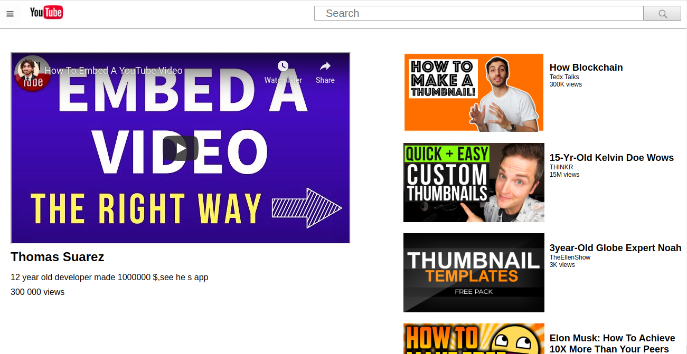

# Embedding Images and Video
The goal of this project is to produce an exact replica of the YouTube video page, but to focus on making the media elements show up.
That means two things – embedding the YouTube video player into the page so it actually plays and showing little thumbnail images along the right side.
[Youtube](https://www.youtube.com)
## Screenshot

 

## Technologies

- HTML 
- CSS

## Live Demo

[Live Demo Link](https://raw.githack.com/kobiyoyo/Images-video/master/index.html)

## Authors

👤 **Adama Chubiyojo Desmond**

-  [Github](https://github.com/kobiyoyo)
-  [Twitter](https://twitter.com/_kobiyoyo)
-  [Linkedin](https://www.linkedin.com/in/chubiyojo-adama/)
-  [Email](adamachubi@gmail.com)

👤 **Danilo Zagarcanin**

- [Github](https://github.com/danilozag1992)
- [Twitter](https://twitter.com/danilo96061514)
- [Linkedin](https://www.linkedin.com/in/danilo-zagarcanin-88169b185/)
- [Email](danilozagarcanin@gmail.com)

## 🤝 Contributing

Contributions, issues and feature requests are welcome!

Feel free to check the [issues page](issues/).

## Show your support

Give a ⭐️ if you like this project!

## Acknowledgments

- Hat tip to anyone whose code was used
- Inspiration
- etc

## 📝 License

This project is [MIT](lic.url) licensed.
